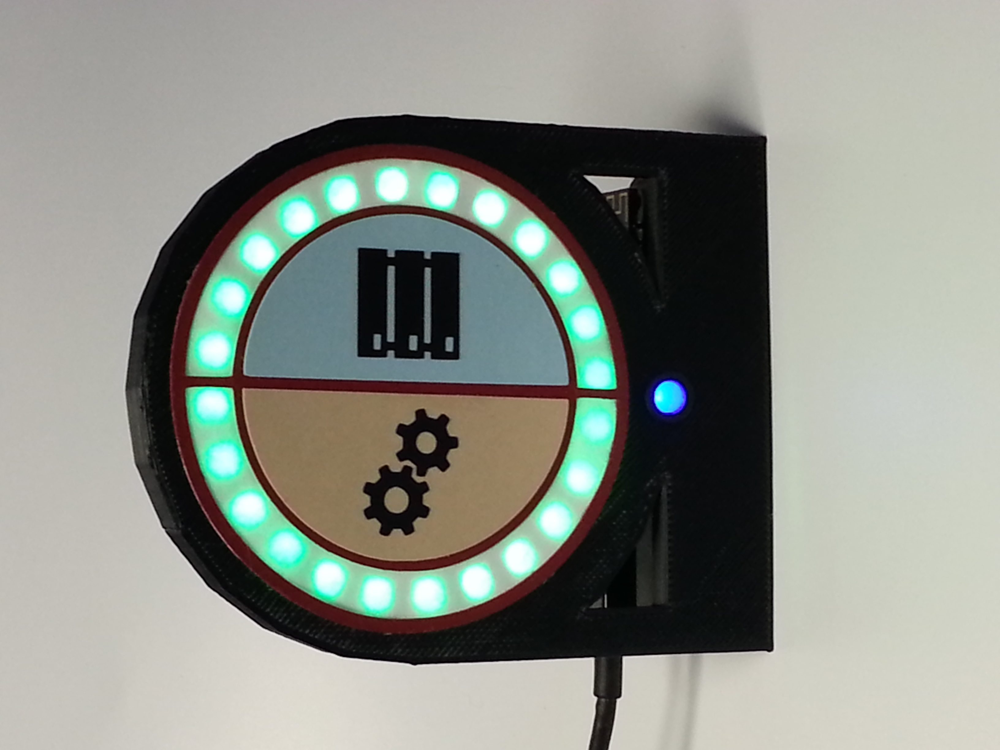
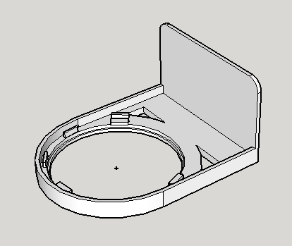

# VersionOne Status Light
This is an Arduino sketch for the VersionOne Status Light that shows recent build and server statuses.

<br/>
Evertyhing's green!

It was originally written for the [Adafruit Feather M0 WiFi - ATSAMD21 + ATWINC1500](https://www.adafruit.com/product/3010), and more recently updated for the [Adafruit HUZZAH32 – ESP32 Feather Board](https://www.adafruit.com/product/3405) since the M0 won't connect to the new WiFi installed in June of 2017.
## Prerequisites
* [Arduino IDE](https://www.arduino.cc/en/Main/Software) 1.8.2 or higher
* ArduinoJson library (installed within the IDE)
* Drivers and Arduino boards as appropriate.  See the Adafruit board links above for specific directions.
## The Program
The sketch polls the [V1ServerStatus API](https://github.com/versionone/V1ServerStatus) to retrieve the Continuum and Zabbix statues for the 12 most recent events for each.  The status is then displayed on the Neopixel ring.  The blue LED just pulses to indicate that the main loop is running to catch any crashes.

For the sketch to compile an additional file excluded from git needs to be added locally, `my_keys.h`, with your debug and production WiFi setup.  The code will try to connect to prod first, then debug.  Here's an example:

```c
#include "Location.h"

#define V1STATUS_PATH "/api/status/statusOnly?count=12"

// IP Addresses are server IPs
Location Locations[2] = {Location("DebugSSID","myWPA2secrect",
                        IPAddress(192,168,1,103),V1STATUS_PATH,5000),
                        Location("ProdSSID","myWPA2secrect",
                        IPAddress(172,16,32,186),V1STATUS_PATH,5000)};
```
## Hardware
* [Adafruit HUZZAH32 – ESP32 Feather Board](https://www.adafruit.com/product/3405)
* [Adafruit 24 NeoPixel Ring](https://www.adafruit.com/product/1586)
* Blue LED, with 220 Ohm current-limiting resistor
* 1000uF Capacitor and 330 Ohm resistor for Neopixel (see the [Adafruit Neopixel Uberguide](https://learn.adafruit.com/adafruit-neopixel-uberguide/best-practices))
* Small Breadboard
* 3D printed bracket.  [SketchUp File](./Doc/24Neopixel.skp), [GCode file](./Doc/24Neopixel.gcode)


