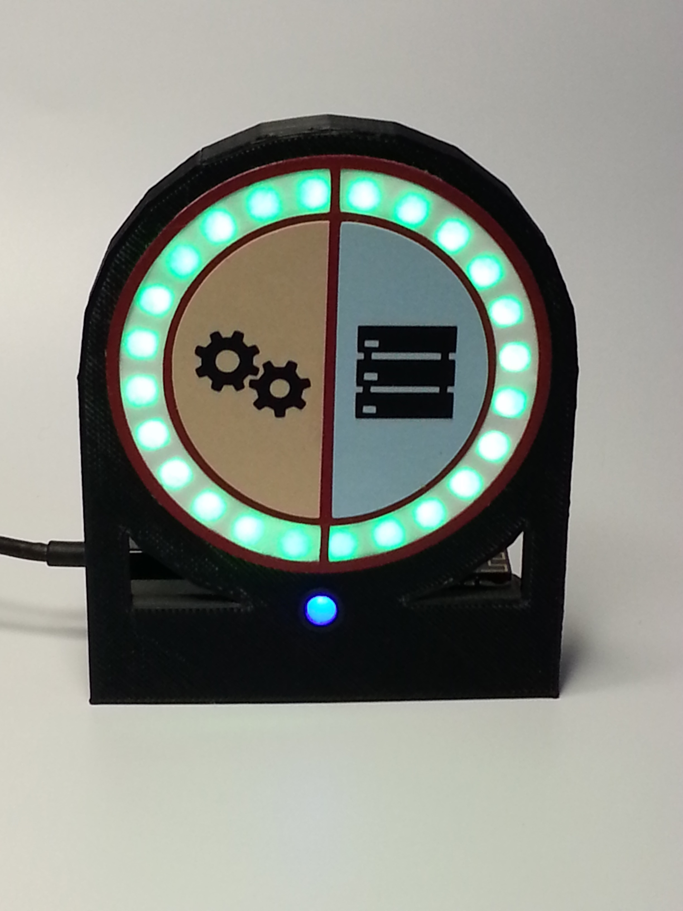

# VersionOne Status Light
This is an Arduino sketch for the VersionOne Status Light that shows recent build and server statuses.

<br/>
Evertyhing's green!

Now with [NeoPixel Cube](https://learn.adafruit.com/free-wire-3x3x3-neopixel-cube/overview) support!

This was originally written for the [Adafruit Feather M0 WiFi - ATSAMD21 + ATWINC1500](https://www.adafruit.com/product/3010), and more recently updated for the [Adafruit HUZZAH32 – ESP32 Feather Board](https://www.adafruit.com/product/3405) since the M0 won't connect to a corporate WiFi installed in June of 2017.  And as of August 2017, it supports the [SparkFun ESP32 Thing](https://www.sparkfun.com/products/13907), and an LED cube.
## Prerequisites
* [Arduino IDE](https://www.arduino.cc/en/Main/Software) 1.8.2 or higher
* ArduinoJson library (installed within the IDE)
* Drivers and Arduino boards as appropriate.  See the Adafruit and SparkFun board links above for specific directions.
## The Program
The sketch polls the [ServerStatus API](https://github.com/seekatar/ServerStatus) to retrieve the most recent Continuum and Zabbix statuses.  The status is then displayed on the Neopixel ring or NeoPixel Cube.  The blue LED just pulses to indicate that the main loop is running to catch any crashes.

To compile the sketch, create a `my_keys.h` file, with your debug and production WiFi setup.  This is in the .gitignore to avoid committing passkeys.  The code will try to connect to prod first, then debug.  Here's an example:

```c
#include "Location.h"

#define SERVER_STATUS_PATH "/api/status/statusOnly?count=12"

// IP Addresses are server IPs
Location Locations[2] = {Location("DebugSSID","myWPA2secrect",
                        IPAddress(192,168,1,103),SERVER_STATUS_PATH,5000),
                        Location("ProdSSID","myWPA2secrect",
                        IPAddress(172,16,32,186),SERVER_STATUS_PATH,5000)};
```
## Hardware
* [Adafruit Feather M0 WiFi - ATSAMD21 + ATWINC1500](https://www.adafruit.com/product/3010), or [Adafruit HUZZAH32 – ESP32 Feather Board](https://www.adafruit.com/product/3405), or [SparkFun ESP32 Thing](https://www.sparkfun.com/products/13907)

For the Ring
* [Adafruit 24 NeoPixel Ring](https://www.adafruit.com/product/1586)
* Blue LED, with 220 Ohm current-limiting resistor
* 1000uF Capacitor and 330 Ohm resistor for Neopixel (see the [Adafruit Neopixel Uberguide](https://learn.adafruit.com/adafruit-neopixel-uberguide/best-practices))
* Small Breadboard
* For the ring, a 3D printed bracket.  [SketchUp File](./Doc/24Neopixel.skp), [GCode file](./Doc/24Neopixel.gcode)


For the Cube (see the guide)
* 27 [NeoPixel 8mm LEDs](https://www.adafruit.com/product/1734)
* 3D printed base from the guide.
* 1000uF Capacitor for Neopixel (see the [Adafruit Neopixel Uberguide](https://learn.adafruit.com/adafruit-neopixel-uberguide/best-practices))

## Voltage Issues
The [SparkFun ESP32 Thing](https://www.sparkfun.com/products/13907) would get erratic performance on the cube, I think mainly due to the 3.3v logic level and the 5v level for the NeoPixels.  I found not using the 330 Ohm resistor on the data line help alot, and then dropping the 5vcc on the NeoPixel a bit with a 10 ohm resistor also helped.  A 3.3v->5v level shifter is in order.  With all 27 LEDs on, the cube draws about 0.1A.

I didn't have any trouble with the ring on either Adafruit boards using the 3.3v output to drive it.